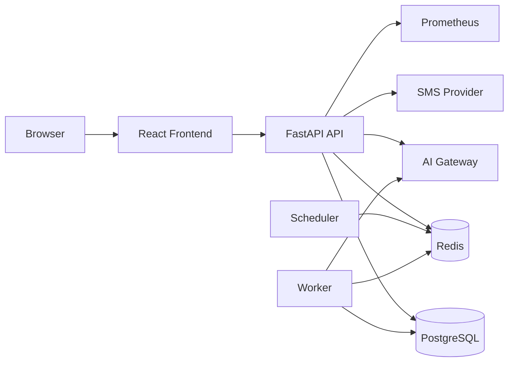
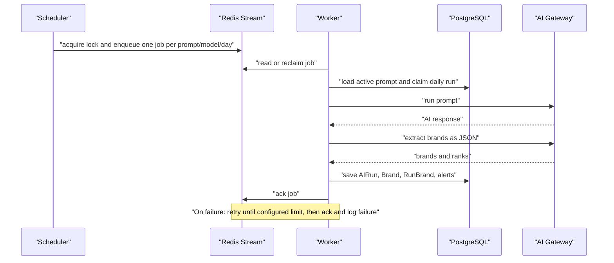

# System Design پروژه FanoosAI

## System Design چیست؟

System Design یعنی توضیح دهیم یک محصول از چه جزءهایی تشکیل شده، هر جزء چه مسئولیتی دارد، داده از کجا وارد و کجا ذخیره می‌شود، و سیستم هنگام خطا یا رشد چه رفتاری دارد. هدف آن «کشیدن یک نمودار زیبا» نیست؛ هدف این است که بتوانیم قبل از تغییر کد بدانیم تغییر ما به کدام بخش‌ها اثر می‌گذارد.

این سند فقط از روی کد فعلی پروژه نوشته شده است. هرجا چیزی در کد یا تنظیمات پروژه دیده نشده، آن را به‌عنوان بخش موجود فرض نمی‌کنیم.

## مسئله‌ای که سیستم حل می‌کند

کاربر در یک سازمان، پروژه می‌سازد و برای آن Prompt تعریف می‌کند. هر Prompt به یک یا چند مدل AI متصل می‌شود. سیستم Prompt را به‌صورت دستی یا روزانه اجرا می‌کند، پاسخ AI را ذخیره می‌کند، با یک درخواست AI دیگر برندها و رتبه‌ی آن‌ها را استخراج می‌کند و سپس تاریخچه، روند، dashboard و هشدار ارائه می‌دهد.

## نمای اجزای سیستم

این نمودار ارتباط و شاخه‌های اصلی را نشان می‌دهد؛ یک فهرست به‌تنهایی تفاوت مسیر هم‌زمانِ درخواست کاربر و اجرای زمان‌بندی‌شده را روشن نمی‌کند.



### اجزا و مسئولیت‌ها

| جزء | مسئولیت واقعی در پروژه | فایل‌های اصلی |
|---|---|---|
| Frontend | رابط React که API را فراخوانی می‌کند؛ منطق آن خارج از بک‌اند است. | `frontend/src` |
| FastAPI API | احراز هویت، API پروژه/Prompt/تحلیل، validation و پاسخ HTTP. | `backend/app/main.py` و routerها |
| PostgreSQL | داده‌ی پایدار کاربران، سازمان‌ها، پروژه‌ها، Promptها، اجراها، برندها و هشدارها. | `database/models.py` |
| Redis | state کوتاه‌مدت OTP و Redis Stream برای صف jobهای اجرا. | `infrastructure/redis_client.py` و `run_queue.py` |
| Scheduler | Promptهای فعال را به jobهای روزانه تبدیل می‌کند. | `scheduler.py` |
| Worker | job را از Redis می‌گیرد و چرخه‌ی اجرای AI و استخراج برند را انجام می‌دهد. | `worker.py` |
| AI Gateway | سرویس خارجیِ chat completion و فهرست مدل‌ها. | `services/ai_service.py` و `ai_model_service.py` |
| SMS Provider | ارسال OTP ورود و ثبت‌نام. | `auth/sms_service.py` |
| Prometheus | دریافت متریک‌های `/metrics`؛ خود exporter در API است. | `observability.py` و `main.py` |

## مرزهای سیستم

### داخل برنامه

API، scheduler و worker سه process منطقی جدا هستند، اما از کدهای مشترک مانند modelها، serviceها و repositoryها استفاده می‌کنند. API نباید برای اجرای scheduled منتظر بماند؛ scheduler فقط job می‌سازد و worker آن را پردازش می‌کند.

### ذخیره‌سازی پایدار و موقت

PostgreSQL منبع حقیقت (source of truth) برای داده‌ی محصول است. Redis داده‌ی دائمی محصول را نگه نمی‌دارد: برای OTP با TTL، lock زمان‌بند و صف اجرا استفاده می‌شود. اگر Redis از کار بیفتد، OTP در production نباید fallback محلی داشته باشد؛ fallback فقط در `DEBUG` فعال است.

### سرویس‌های بیرونی

AI Gateway و Melipayamak از مرز شبکه‌ی پروژه بیرون هستند و می‌توانند timeout یا خطا بدهند. AI service برای خطای موقت و rate limit retry دارد؛ SMS client خطا را log می‌کند و endpoint نتیجه‌ی ناموفق را به خطای موقت سرویس تبدیل می‌کند.

## معماری کد در بک‌اند

```text
router  →  service  →  repository  →  SQLAlchemy model  →  PostgreSQL
  HTTP      business       query          table/schema
```

- **router** ورودی HTTP را با Pydantic می‌گیرد، کاربر را از JWT می‌شناسد و کد وضعیت HTTP برمی‌گرداند.
- **service** تصمیم‌های کسب‌وکار را می‌گیرد؛ مانند سقف Prompt فعال، اجرای روزانه یا اعتبار OTP.
- **repository** query و commit دیتابیس را در یک جا نگه می‌دارد.
- **model** شکل جدول‌ها، کلیدهای خارجی، unique constraintها و relationshipها را تعریف می‌کند.

این جداسازی کامل و سخت‌گیرانه نیست: چند endpoint ساده، query را مستقیم در router انجام می‌دهند؛ برای نمونه بخشی از endpointهای analytics و projects. این یک مشاهده از کد فعلی است، نه اشکال ذاتی.

## مدل داده‌ی اصلی

```text
User ──< OrganizationMember >── Organization ──< Project ──< Prompt
                                                        │        │
                                                        │        ├──< PromptModel >── AIModel
                                                        │        └──< AIRun ──< RunBrand >── Brand
                                                        │
                                                        ├──< ProjectBrand
                                                        ├──< AlertRule
                                                        ├──< Alert
                                                        └──< ReportShare
```

مهم‌ترین نکته این است که پروژه به سازمان تعلق دارد و دسترسی با `OrganizationMember` تعیین می‌شود. `PromptModel` رابطه‌ی چندبه‌چند بین Prompt و مدل AI است. هر `AIRun` به یک Prompt و یک مدل مربوط است؛ `RunBrand` برندهای پیدا شده و رتبه‌ی هر برند را به همان اجرا وصل می‌کند.

### constraintهای مهم

- `OrganizationMember`: یک کاربر فقط یک عضویت برای هر سازمان دارد.
- `PromptModel`: یک مدل فقط یک بار به یک Prompt وصل می‌شود.
- `DailyPromptRun`: یک جفت Prompt/Model در یک روز فقط یک بار claim می‌شود.
- `RunBrand`: یک برند در یک اجرای AI فقط یک بار ثبت می‌شود.
- `Brand.domain` و token اشتراک گزارش یکتا هستند.

این قیدها مهم‌اند چون منطق برنامه به‌تنهایی در برابر درخواست هم‌زمان کافی نیست. برای نمونه، `AIRunRepository.claim_daily_run` بعد از بررسی اولیه، به unique constraint دیتابیس نیز تکیه می‌کند تا دو worker نتوانند یک اجرا را هم‌زمان claim کنند.

## جریان اول: درخواست معمول API

نمونه: کاربر یک Prompt می‌سازد.

1. frontend درخواست `POST /projects/{project_id}/prompts` را با cookie JWT می‌فرستد.
2. FastAPI با `fastapi_users.current_user()` کاربر را شناسایی می‌کند.
3. `prompt_router` نقش نوشتن کاربر برای پروژه را بررسی می‌کند.
4. `PromptService` تکراری نبودن متن، فعال بودن مدل‌ها و سقف Prompt فعال را کنترل می‌کند.
5. `PromptRepository` جدول‌های `prompts` و `prompt_models` را ذخیره می‌کند.
6. پاسخ `PromptRead` به frontend برمی‌گردد.

درخواست‌های analytics نیز همین مسیر را دارند، با این تفاوت که بیشتر خواندنی‌اند و queryهای گزارش‌گیری را اجرا می‌کنند.

## جریان دوم: اجرای دستی Prompt

وقتی کاربر endpoint اجرای Prompt را فراخوانی می‌کند، API همان درخواست را هم‌زمان پردازش می‌کند؛ این کار از صف Redis عبور نمی‌کند. `AIRunService` برای هر مدل متصل، claim روزانه می‌گیرد؛ اگر آن مدل در همان روز قبلاً اجرا شده باشد، نتیجه‌ای برای آن برنمی‌گرداند.

پس از claim موفق، متن Prompt به AI Gateway می‌رود. پاسخ اصلی در `AIRun` ذخیره می‌شود. سپس `BrandExtractionService` با یک prompt و JSON schema مشخص، برندها و رتبه‌ها را از پاسخ استخراج می‌کند. `BrandPersistenceService` آن‌ها را به Brandهای موجود تطبیق یا Brand تازه ایجاد می‌کند و `RunBrand`ها را ذخیره می‌کند. در انتها ruleهای هشدار برای خطای اجرا، رقیب جدید، افت رتبه و ناپدید شدن برند بررسی می‌شوند.

## جریان سوم: اجرای زمان‌بندی‌شده



`scheduler.py` در هر چرخه lock می‌گیرد تا دو scheduler هم‌زمان job تکراری نسازند. `enqueue_once` نیز با Lua script در Redis یک کلید deduplication دو روزه می‌گذارد. worker jobهای idle را با `XAUTOCLAIM` بازپس می‌گیرد، بنابراین jobی که worker قبلی در میانه‌ی کار رها کرده است دوباره قابل پردازش می‌شود.

## احراز هویت و مجوزها

ورود اصلی با SMS OTP است. کد OTP با TTL در Redis ذخیره می‌شود، درخواست کد cooldown دارد و تعداد تلاش ناموفق محدود است. پس از تأیید، API JWT را در cookie `HttpOnly` و `SameSite=lax` قرار می‌دهد؛ در production cookie `secure` است.

مجوز پروژه فقط مالک اولیه‌ی پروژه نیست: هر user عضو سازمان پروژه می‌تواند با توجه به نقش عمل کند. `owner` و `admin` مدیریت پروژه دارند، `analyst` می‌تواند بنویسد و `viewer` برای خواندن در نظر گرفته شده است. repositoryهای پروژه این بررسی‌ها را به queryهای عضویت سازمان وصل می‌کنند.

## پایداری، خطا و مشاهده‌پذیری

| موضوع | رفتار فعلی |
|---|---|
| سلامت سرویس | `/health/live` برای زنده بودن process و `/health/ready` برای اتصال PostgreSQL و Redis است. |
| متریک | `/metrics` متریک Prometheus شامل تعداد/مدت HTTP، AI و queue را می‌دهد. |
| لاگ | لاگ JSON شامل timestamp، سطح، نام logger، event data و request id است. |
| خطای AI | سه تلاش با backoff برای خطاهای شبکه، timeout، 429 و 5xx؛ نتیجه‌ی نهایی failed ذخیره می‌شود. |
| خطای job | worker تا `REDIS_JOB_MAX_RETRIES` job را دوباره صف‌بندی می‌کند، سپس آن را ack و خطا را log می‌کند. |
| اجرای تکراری | Redis deduplication برای enqueue و unique constraint دیتابیس برای daily claim هر دو وجود دارند. |
| shutdown | API Redis و connection pool دیتابیس را در lifespan می‌بندد؛ worker session مشترک AI را می‌بندد. |

## ظرفیت و نقاط رشد

این پروژه اکنون یک معماری modular monolith دارد: یک کدبیس FastAPI با processهای API، scheduler و worker؛ هنوز microserviceهای مستقل نیست. این انتخاب برای مرحله‌ی فعلی ساده و مناسب است، چون domain و modelها مشترک‌اند و نیاز به شبکه و deployment پیچیده‌ی بین سرویس‌ها ندارد.

در صورت رشد واقعی، این نقاط باید اندازه‌گیری شوند، نه صرفاً پیش‌بینی:

- **AI Gateway**: زمان پاسخ و rate limit، گلوگاه اصلی اجرای Prompt است؛ تعداد worker و retry باید با متریک تنظیم شود.
- **PostgreSQL analytics**: queryهای trend/history با بزرگ شدن `AIRun` و `RunBrand` سنگین می‌شوند؛ index و pagination موجود شروع خوبی هستند، اما باید با داده‌ی واقعی بررسی شوند.
- **Redis Stream**: consumer group امکان چند worker را می‌دهد؛ تعداد worker باید متناسب با throughput AI و اتصال دیتابیس باشد.
- **پاک‌سازی**: scheduler Promptهای آرشیوشده را بعد از ۳۰ روز پاک می‌کند و retention اجراهای AI مسیر جداگانه‌ای دارد؛ policy نگه‌داری باید با نیاز محصول هماهنگ بماند.

## مواردی که در مخزن به‌صراحت دیده نمی‌شوند

این سند reverse proxy، load balancer، backup دیتابیس، deployment process، alert delivery واقعی (email/Slack) یا migration فعال Alembic را موجود فرض نمی‌کند، چون implementation یا configuration کامل آن‌ها در مسیرهای بررسی‌شده نیست. وجود `deploy/prometheus/alerts.yml` نشان می‌دهد برای alertهای Prometheus تنظیماتی هست، اما به تنهایی معماری استقرار کامل را مشخص نمی‌کند.

## چگونه با این سند پروژه را بخوانم؟

1. ابتدا نمودار اجزا و مدل داده را بخوانید تا واژه‌های پروژه را بشناسید.
2. فایل‌های `main.py`، `database/models.py` و `core/config.py` را باز کنید.
3. برای مسیر محصول، `projects/prompt_router.py` را تا `services/ai_run_service.py` دنبال کنید.
4. برای کار async، `scheduler.py`، `infrastructure/run_queue.py` و `worker.py` را به همین ترتیب بخوانید.
5. برای گزارش‌گیری، یک endpoint در `analytics/router.py` را انتخاب کنید و tableهای joinشده را در `models.py` پیدا کنید.

## یادداشت اعتبارسنجی نمودارها

نمودار اول یک flowchart ده‌گرهی است، چون ارتباط و دو مسیر API/scheduler را نشان می‌دهد؛ نمودار دوم یک sequence با پنج participant است، چون ترتیب پیام‌های job مهم است. همه‌ی labelهای دارای فاصله quote شده‌اند و هر دو نمودار زیر حد خوانایی پیشنهادشده هستند.
